# Technical Documentation: Google Voice Command for Gmail

## Overview

Voice Command integrates with the existing Gmail infrastructure to enable users to manage their email accounts through voice input. This feature is built on Google’s voice recognition and natural language processing (NLP) technologies, leveraging Gmail’s API for email composition, management, and inbox navigation. Developers can access this functionality through a set of API endpoints and voice-to-text models that process and execute user commands.

This document outlines the architecture, API endpoints, and integration specifics necessary for developers to work with and extend the Google Voice Command feature.

## Architecture Overview

Voice Command operates by integrating several core systems:

- **Google Voice Recognition Service**: Converts voice input to text, handles natural language processing, and extracts actionable commands.
- **Gmail API**: Executes the backend tasks (e.g., sending an email, fetching inbox data) based on user commands.
- **Action Execution Layer**: A middleware component that maps voice commands to specific Gmail API calls.

When a user speaks a command (e.g., “Send an email”), the following flow is executed:

```mermaid
graph LR
    subgraph User Interface
        A[User Voice Input] --> B[Voice Recognition Engine]
    end

    subgraph Natural Language Processing
        B --> C[Speech-to-Text Conversion]
        C --> D[Command Parser]
        D --> E[Intent Classification]
    end

    subgraph Action Execution Layer
        E --> F[Command Validator]
        F --> G[API Command Mapper]
        G --> H[Authentication Handler]
    end

    subgraph API Integration
        H --> I[Gmail API]
        I --> J[Response Handler]
    end

    subgraph User Feedback
        J --> K[Response Formatter]
        K --> L[Voice/Visual Feedback]
    end

    %% Styling
    classDef interface fill:#e3f2fd,stroke:#1565c0
    classDef nlp fill:#e8f5e9,stroke:#2e7d32
    classDef execution fill:#fff3e0,stroke:#ef6c00
    classDef api fill:#f3e5f5,stroke:#7b1fa2
    classDef feedback fill:#fce4ec,stroke:#c2185b

    class A,B interface
    class C,D,E nlp
    class F,G,H execution
    class I,J api
    class K,L feedback
```

1. Voice Input: The user speaks a command.
2. Voice Recognition and NLP: The voice recognition engine processes the speech, converts it into text, and parses it into a structured command.
3. Gmail API Invocation: The Action Execution Layer translates the command into the corresponding Gmail API call, handling authentication and execution.
4. Response Handling: The result is relayed back to the user (e.g., email sent, unread emails listed).

For more information about the 