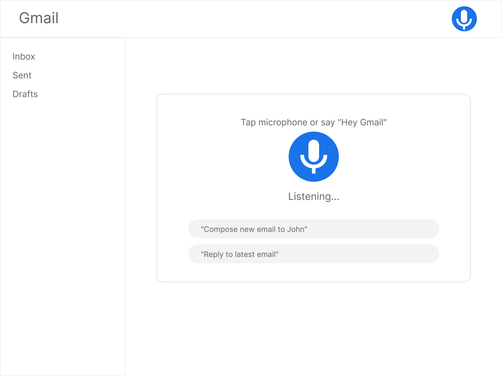

# Activating Voice Commands

Once Google Voice Command is set up, you can start managing your Gmail inbox using voice commands. The feature supports a wide range of commands for composing, sending, and organizing emails, as well as managing your inbox with advanced email controls. To start using the Voice Command:

1. Activate Voice Command by saying “*OK Google*” or “*Hey Google*,” or by taping the microphone icon from the Main View.
    
2. Once activated, you can issue commands to interact with your Gmail account.

For more information about the available commands, see the [Commands Reference](https://egoranuchin.github.io/ea-billing-platform-test/user-guide/commands/commands.html).